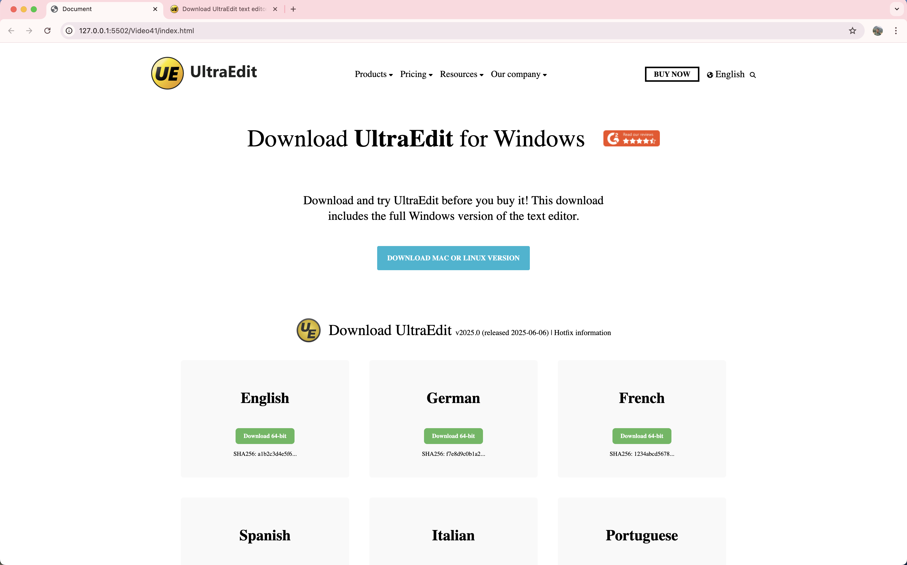
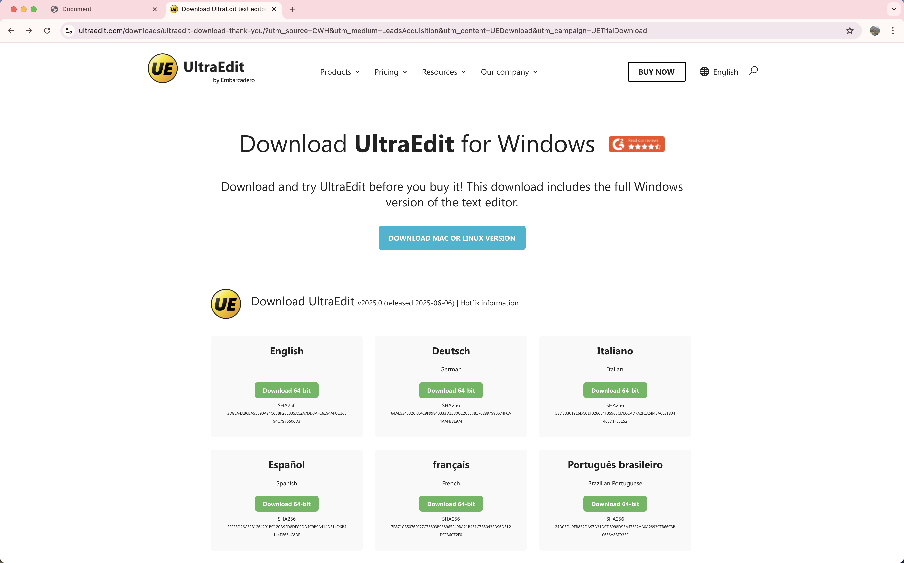

# 💻 UltraEdit-style Download Page – Mini Project

A fully responsive and modern download page inspired by [UltraEdit](https://www.ultraedit.com/downloads/ultraedit-download-thank-you/?utm_source=CWH&utm_medium=LeadsAcquisition&utm_content=UEDownload&utm_campaign=UETrialDownload), built using **only HTML & CSS**. This project was created as part of my **Web Development Learning Journey (Day 18)** to practice semantic structure, responsive layout, and UI component design.

---

## 🚀 Features

- ✅ Responsive Header with Navigation
- ✅ CTA Buttons with Clean Styling
- ✅ Font Awesome & Material Icons Integration
- ✅ Download Cards with SHA256 Information
- ✅ Flexbox Layout for Responsive Grid
- ✅ Media Queries for Mobile Optimization
- ✅ Footer with Attribution and Clean Design
- ✅ Fully Built with HTML5 and CSS3 (No JS)

---

## 📸 Project Preview

### 🔧 My Version – Built from Scratch with HTML & CSS



---

### 🎯 Original UltraEdit Website Design (Reference)



---

## 🧰 Tech Stack

- HTML5 (Semantic Tags)
- CSS3 (Flexbox, Media Queries)
- Google Fonts: [Segoe UI](https://fonts.google.com/)
- Icons:
  - [Font Awesome 6](https://fontawesome.com/)
  - [Material Icons](https://fonts.google.com/icons)

---

## 📂 Project Structure

```
📁 project-root
├── index.html
├── style.css
├── /Images
│   └── small_icon.png
│   └── icon.png
└── Preview
    └── My-Demo.png
    └── Original.png
```

---

## 📝 How to Use

1. Clone this repository:

   ```bash
   git clone https://github.com/Aryan132004/Ultra-UI-copy.git
   ```
2. Open `index.html` in your browser.
3. That’s it — no setup or server required!

---

## 📚 What I Learned

- Structuring content with semantic HTML
- Writing clean, reusable CSS
- Using Flexbox for layout and alignment
- Handling responsiveness with media queries
- Integrating third-party fonts and icons
- Designing a realistic landing page UI

---

## 🔗 Live Demo

[👉 View it on Linkedin Pages](https://www.linkedin.com/posts/aryanmalik2004_webdevjourney-miniproject-htmlcss-activity-7345509893186994177-y5G6?utm_source=share&utm_medium=member_desktop&rcm=ACoAADikt0IB0_f8pY6_Ja7wTp0G1XZ27avnNu0)

---

## 🧑‍💻 Author

**Aryan**
🌐 [LinkedIn](www.linkedin.com/in/aryanmalik2004)
📧 Email: malikaryan132004@email.com

---

## 📃 License

This project is for **educational and practice purposes only**.
All logos and trademarks are owned by their respective companies.

---

⭐️ Don’t forget to **star** this repo if you found it helpful!
